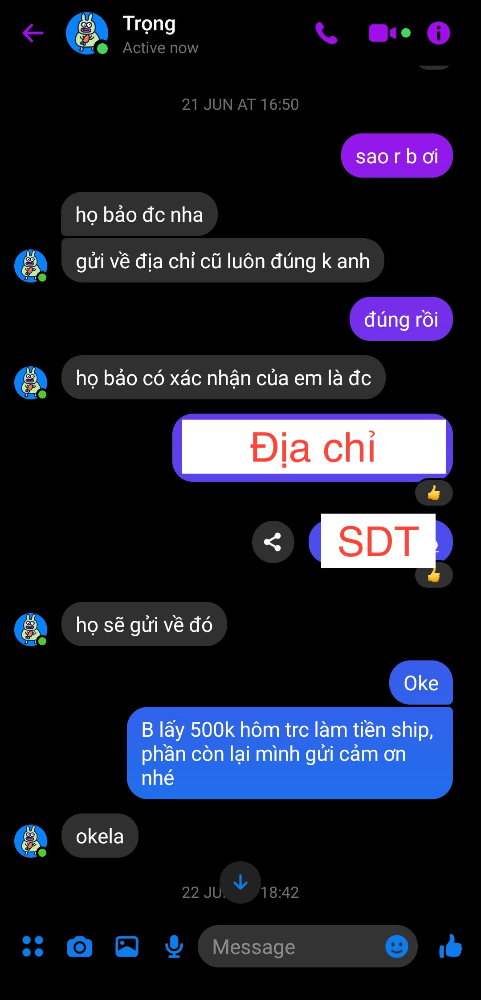
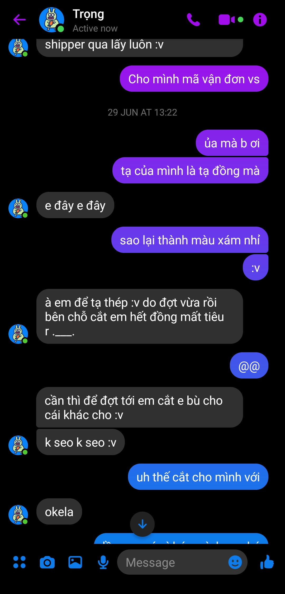
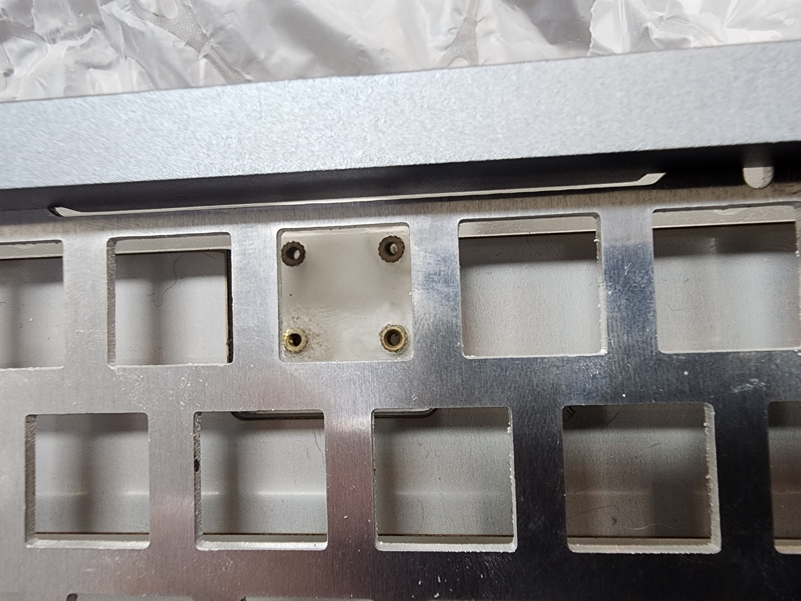

# Mechdrama Quốc Trọng

---

### Khởi đầu

- Ngày 6/3/2023, đặt vấn đề với Quốc Trọng để CNC một con phím có sẵn bản vẽ
- Quốc Trọng báo file có vấn đề và offer sửa lại để giảm giá thành

# Báo giá

### 1. Quốc Trọng báo giá 3.500.000đ

Ngày 29/03/2023, mình và Trọng đã chốt được design và gửi bên xưởng Trung để báo giá tiền

### 2. Đã thanh toán cọc 2.000.000đ

### 3. Ngày 19/4/2023, thông tin: ĐẦU THÁNG 5 VỀ VIỆT NAM

- Sau khoảng 3 tuần, mình hỏi lại Trọng về thời gian
- Trọng báo đầu tháng 5 KIT VỀ VIỆT NAM

- 2/5/2023, thông tin: 10/5 có KIT

- 12/5/2023, delay: tuần sau có

### 3. 24/5/2023, thông tin: KIT ĐÃ VỀ TỚI VIỆT NAM

- 18/5/2023, không rep
- 24/5/2023, Trọng báo đã về đến Việt Nam, đã mang đi xử lý

### 4. 29-31/5/2023, không rep

### 5. 14:53 31/5/2023, chuyển nốt 1.500.000đ tiền case, Trọng bỗng nhiên rep tin nhắn lúc 15:24

- Sau 3 ngày không có tin tức gì, chuyển nốt 1.500.000đ với hy vọng Trọng rep, ai ngờ Trọng rep thật.
- Nhận được thông tin chưa đẩy case vào anode -> vẫn oke vui vẻ
  

### 6. 14:53 31/5/2023, chuyển nốt 1.500.000đ tiền case, Trọng bỗng nhiên rep tin nhắn lúc 15:24

- Sau 3 ngày không có tin tức gì, chuyển nốt 1.500.000đ với hy vọng Trọng rep, ai ngờ Trọng rep thật.
- Nhận được thông tin chưa đẩy case vào anode -> vẫn oke vui vẻ
  

### 7. Chuyển khoản thêm 500.000đ để Trọng nhờ nhà máy cho anode ké

### 8. Hỏi lại tình hình xưởng báo

- Tối ngày 31/5 - 3/6: báo chưa anode được

- Ngày 6/6 và 8/6 hỏi lại:

- Ngày 13/6: vẫn chưa được anode

### 9. Thiết kế...

- Ngày 14/6, phát hiện dấu hiệu lạ ở trên top, hỏi ra thì Trọng đã thêm hẳn 2 lỗ bên cạnh vì sợ "không cứng"

  
  
  
  

### 10. 16/6/2023: Thông tin: Thứ hai tuần sau (19/6/2023) sẽ được ship đến Trọng

### 10. 19/6/2023: Tiếp tục delay, chưa gửi được hàng, và vẫn không có ảnh

- Trọng báo chưa gửi được hàng, và cũng không có ảnh
- Xưởng vẫn chưa gửi kit cho Trọng
- Nhờ Trọng hỏi xưởng ship thẳng ra Hà Nội
- Trọng báo ship được thẳng ra Hà Nội
- Tặng Trọng 500k trước đây gửi, trừ tiền ship

### 11. 25/6/2023: Thông tin: 26/6/2023 gửi shipper. Đã có ảnh

- Thông tin: 6h chiều 26/6/2023 shipper sẽ qua lấy, nhưng trên app Viettel không hề có đơn hàng -> chưa tạo đơn

### 11. 28/6/2023: Thông tin: 26/6/2023 gửi shipper. Đã có ảnh

- Thông tin: Vẫn chưa được lấy hàng, đã đổi sang GHN nhưng không hề được thông báo

### 12. 29/6/2023: Bất ngờ chưa, tạ đồng -> sắt

- Hết đồng tự ý đổi sang sắt mà chưa hề thông báo với mình (thật ra cũng giống hệt trước đây)
- 30/6/2023: Cuối cùng cũng có mã vận đơn

### 13. 3/7/2023: Nhận hàng với nỗi thất vọng

- Nhận hàng, thấy ngay 2 vết cấn. Tiếc là mình quá nóng vội nên đã quên quay video unbox
- Đổi ốc case từ M3 -> M2.5. Ốc titan mua trước để lắp kit này không dùng được luôn
- Không có half plate. Plate chưa được anode
- Không có đường chamfer
- Vẫn dán cái sticker, không bóc ra nổi
- Lỗ daughter board cấy ecu rất xấu
- 2 lỗ ốc hai bên trông...

#### Cấn

### Lỗi

### 14. 5/7/2023 - 14/7/2023: Không thể liên lạc

- Từ 5/7/2023 - 14/7/2023 không rep tin nhắn
- 14/7/2023: Thông tin: Đã CNC xong tạ đồng và xử lý

### 14. Vẫn chưa nhận được tạ đồng

- 31/7/2023: Tiếp tục quên gửi tạ đồng
- 5/8/2023 - Hiện tại: Vẫn chưa rep tin nhắn, cũng không có đơn hàng nào được gửi

### Note
- Tất cả những lần Quốc Trọng không rep tin nhắn mình, mình vẫn thấy Trọng online và đang đi comment dạo ở nhiều bài viết, cũng như đăng bán hàng

## Tổng kết
- Mình dù sao cũng cảm ơn Trọng đã sửa bản vẽ giúp mình.
- Ở đây mình chủ yếu phốt về **THÁI ĐỘ LÀM VIỆC** của Trọng. 
- Trong quá trình làm việc từ tháng 3, hứa hẹn đến khi đầu tháng 7 nhận kit, thứ mình hay được nhận được nhất là các lý do của Trọng để delay gửi hàng
- Hiện giờ vẫn chưa lấy được tạ đồng và half plate. Nhưng mình cũng đã quá mệt mỏi với con kit này.
